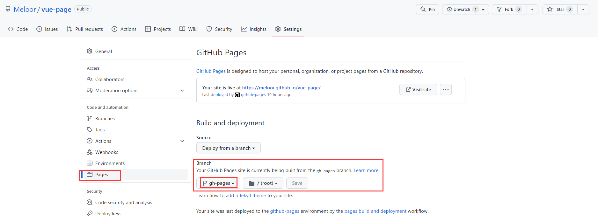

# Meloor, front-end web learner
This is my [website](https://meloor.github.io/), built on chrisbobbe's [Jekyll adaptation](https://github.com/chrisbobbe/jekyll-theme-prologue) of [Prologue](http://html5up.net/prologue), a [free](http://html5up.net/license) responsive site template designed by [HTML5 UP](http://html5up.net).
## 1. 介绍

jekyll搭建的个人博客。

## 2. jekyll部署到github pages步骤
[windows安装jekyll的过程及遇到的问题](./_posts/2019-06-18-install_jekyll.md)
### **0 环境配置**
...
### **1 寻找主题fork**
...
### **2 配置主题**
...
### **3 推送到github的部署分支**
>与hexo不同，github pages自带jekyll引擎，不需要本地编译，只需要推送源码
>* 在jekyll, git push,推送 **源码目录(/)** 到远程仓库的部署分支(jekyll-src)
>* 而在hexo, hexo deployer会推送**打包目录(public)** 到远程仓库的部署分支(hexo-melody-pages)

 
 ###  **4 github action 自动部署**
>github pages设置好部署分支(jekyll-src)后，只要接受到了该分支的推送，就会进行**自动部署**(**而gitee pages需要手动点击‘更新’**), 等待1-2分钟，进入[http://meloor.github.io](http://meloor.github.io)页面就可以看到更新。
   